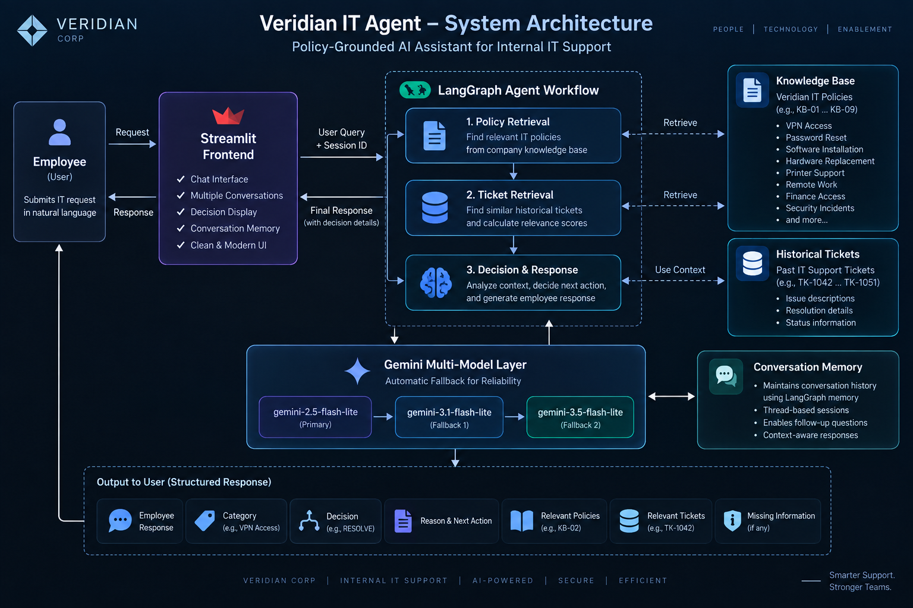

# Veridian IT Agent 🤖

## Internal Service Agent — IT Support

A policy-grounded Agentic AI assistant built for **Veridian Corp** to handle internal IT support requests.

The agent uses **LangGraph** to orchestrate policy retrieval, historical ticket retrieval, decision-making, and response generation. It uses **Gemini** models with automatic fallback to improve reliability and maintains conversation context for follow-up questions.

---

## 🎯 Project Objective

The goal of this project is to build an internal IT support agent capable of:

- Understanding employee IT requests in natural language
- Retrieving relevant company IT policies
- Searching historical IT support tickets
- Determining the appropriate next action
- Resolving requests when possible
- Asking for clarification when information is missing
- Routing requests to IT, Finance, or Security when required
- Providing policy-grounded explanations
- Maintaining conversation context across follow-up questions
- Returning structured decisions and supporting evidence

The agent uses only the provided Veridian Corp knowledge base and ticket/request data as its source data.

---

# 🏗️ System Architecture



The system follows a **Retrieve → Decide → Respond** architecture implemented using LangGraph.

### High-Level Flow

```text
Employee
   │
   ▼
Streamlit Frontend
   │
   │ User Request + Conversation Context
   ▼
LangGraph Agent
   │
   ├──► Policy Retrieval
   │       │
   │       └──► Veridian Knowledge Base
   │
   ├──► Ticket Retrieval
   │       │
   │       └──► Historical IT Tickets
   │
   └──► Decision & Response
           │
           ▼
      Gemini Model Layer
           │
           ├── Gemini 2.5 Flash-Lite
           ├── Gemini 3.1 Flash-Lite
           └── Gemini 3.5 Flash-Lite
           │
           ▼
     Structured Response
           │
           ▼
        Employee